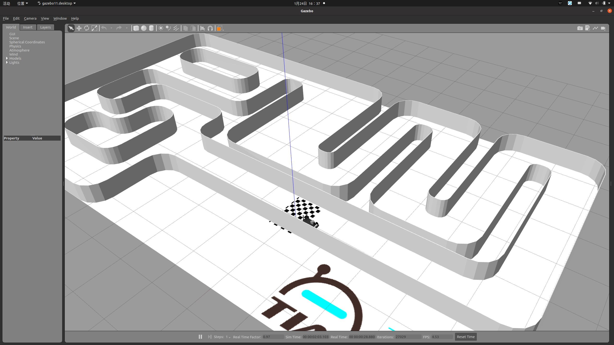
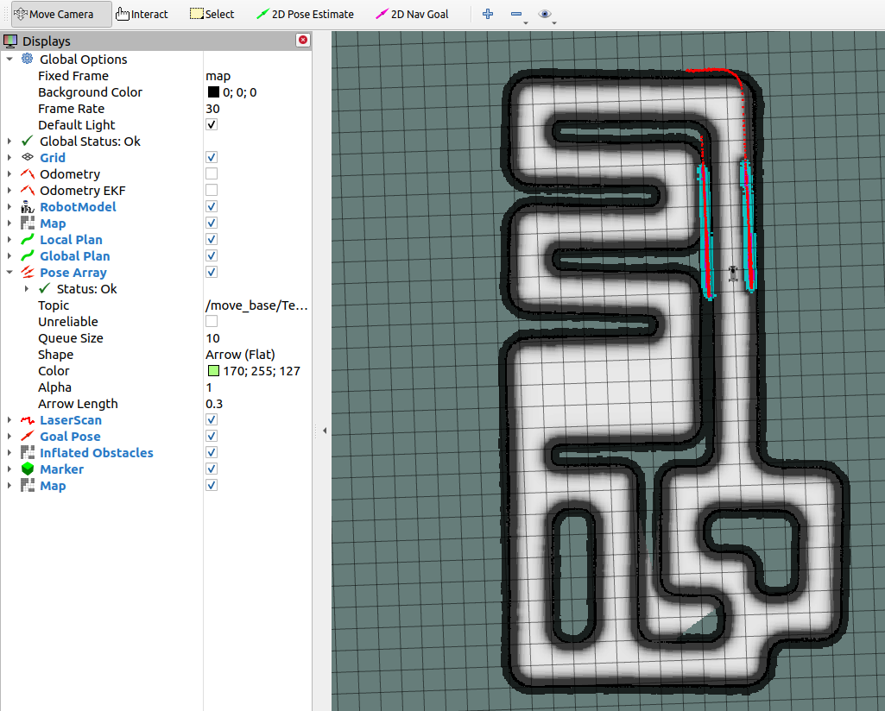
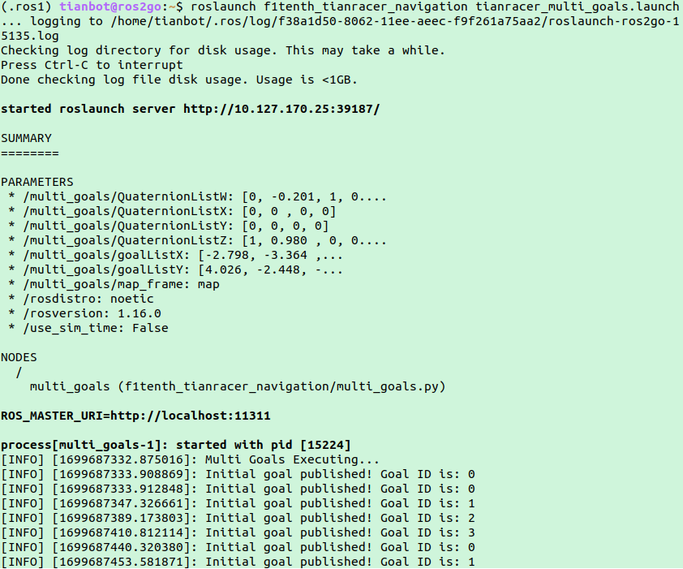
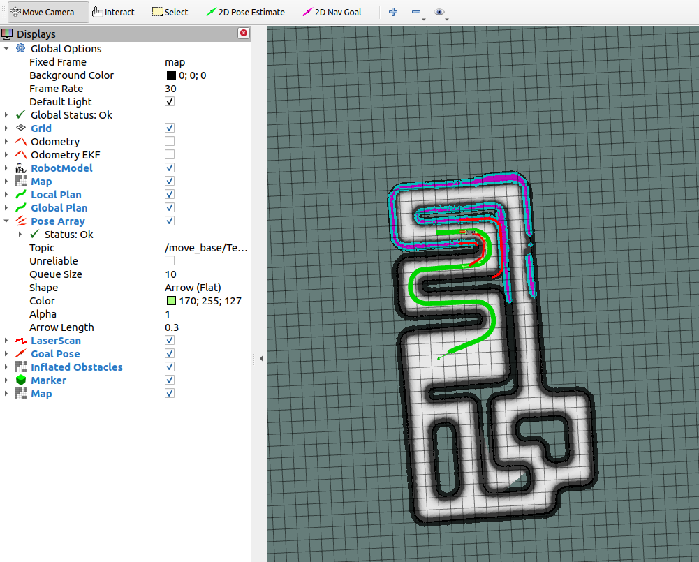

# f1tenth

The second-place strategy in F1TENTH ICAUS 2022. And This repository primarily focuses on the simulations in  F1TENTH environment, specifically based on reactive and navigation methods.

## 编译

相关代码主要运行在Ubuntu20.04和ros1-noetic环境下，在catkin_ws/src路径下:
```
git clone git@github.com:npu-iuslab/f1tenth.git
cd ..
catkin_make
source devel/setup.bash
```

## 使用
#### 启动仿真环境

```bash
roslaunch f1tenth_tianracer_gazebo demo_tianracer_teb_nav.launch 
```
具体的gazebo仿真效果和rviz可视化界面如下：

  

  

#### 使用反应式算法

```bash
rosrun f1tenth_tianracer_navigation run_in_sim.py
```

本次代码所使用的的反应式算法为Disparity Extender，其主要原理为：

- 查找视差，由于侵入汽车路径的障碍物将导致激光雷达数据的“差异”，可以使用“视差”来指代距离值数组中的两个连续点，它们之间的差异大于某个预定义阈值。
- 对雷达数据进行修改，对视差进行扩展，即视差出现的地方的距离值会覆盖周围的距离值，覆盖范围为汽车的宽度。
- 对每个差异重复此过程。（切勿用较远的“距离”覆盖较近的“距离”，近距离的障碍物优先度更高）
- 在新的距离列表中找到最远的可到达距离，并将其用作目标方向。
  


#### 使用多点导航

```bash
roslaunch f1tenth_tianracer_navigation tianracer_multi_goals.launch 
```

在已经建好的地图上，可以通过话题move_base_simple/goal来记录或发布导航点，执行导航命令。而多点导航的原理即通过脚本循环发布导航点，而发布下一个导航点的前提条件是通过计算小车当前位置与导航点的距离小于某个阈值。故增大阈值，可以提高小车经过导航点的速度以及减少调整的时间，但是会适当降低精度。减小阈值，小车往往需要花费时间来调整自身的位姿以达到要求，但是会显著提高小车到达导航点的精度。
其次是导航点的具体参数，即在地图上的二维坐标以及四元数，这个需要在地图上自己规划，合理的导航点可以减少小车的调整和决策时间，从而更加流畅的完成导航任务。tianracer_multi_goals.launch的主要功能是启动multi_goals.py的ROS节点，为该节点提供导航点的坐标和姿态四元数。其中goalListX和goalListY为x、y坐标，QuaternionListX、QuaternionListY、QuaternionListZ、QuaternionListW为到达目标点的位姿四元数。具体执行效果如下：
  

  

## 问题分析
由于ROS2GO的环境问题，在启动仿真环境时会缺乏PyKDL库的索引，直接的解决方法是进入环境变量配置文件.bashrc后添加相关的路径索引：
```
sudo gedit ~/.bashrc
export PYTHONPATH="${PYTHONPATH}:/usr/lib/python3/dist-packages/"
```
编译过后的部分执行文件可能会因缺乏可执行权限而报错，可以直接给对应功能包的scripts文件夹下的python文件赋予权限。

## Copyright

Please check out the original authors' repo for more details: https://github.com/tianbot/tianracer/tree/master .Test methods come with their own license, and the rest follow the  license.
